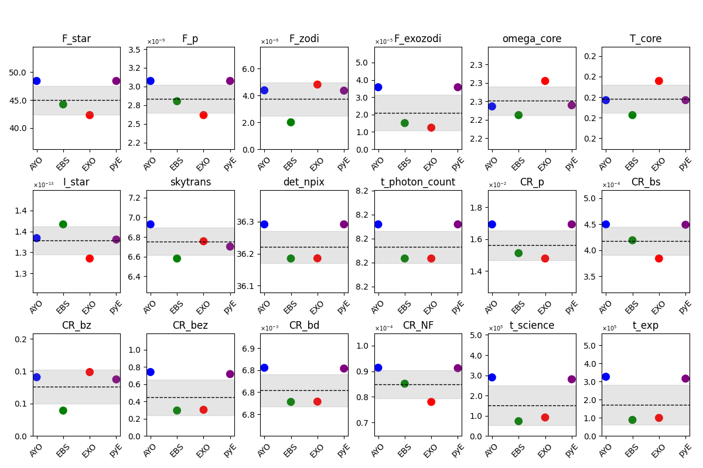

# Validation

[Stark et al. 2025](https://ui.adsabs.harvard.edu/abs/2025arXiv250218556S/abstract) recently compared existing exposure time calculators for HWO (AYO, EXOSIMS, and EBS). We followed the same validation process with `pyEDITH`, confirming a general agreement between our code and the others. 

As part of the `pyEDITH` testing pipeline, we reproduced the validation scenarios compared in [Stark et al. 2025](https://ui.adsabs.harvard.edu/abs/2025arXiv250218556S/abstract) and found a reasonable agreement. 

Since `pyEDITH` stems from AYO, we expect to find the smallest differences between AYO and `pyEDITH`. This is not always the case: we noticed some minor differences in the calculation of the zero-point flux between IDL and Python, which are caused by intrinsic differences in the interpolation algorithm.  These differences caused all of the variables dependent on the zero-point flux (the stellar leakage, the exozodi, the noisefloor count rates, as well as the exposure time) to be different up to 10%, which also appeared in the general ETC comparison performed by [Stark et al. 2025](https://ui.adsabs.harvard.edu/abs/2025arXiv250218556S/abstract).

We also notice some differences in the calculation of some coronagraph-related variables ({math}`I\_star`, {math}`omega\_core`): `pyEDITH` relies on the Python-based external package [yippy](https://yippy.readthedocs.io/en/latest/) for the calculation of these variables, which is marginally different from the original AYO calculation.

In the figures below, we show the results for the three earlier ETCs (AYO in blue, EBS in green, EXOSIMS in red) compared to pyEDITH (in purple), for all the cases explored in [Stark et al. 2025](https://ui.adsabs.harvard.edu/abs/2025arXiv250218556S/abstract).

**HIP 26779 at 500 nm**

**HIP 26779 at 1000 nm**

**HIP 32439 at 500 nm**

**HIP 32439 at 1000 nm**

**HIP 77052 at 500 nm**

**HIP 770272 at 1000 nm**

**HIP 113283 at 500 nm**

**HIP 113283 at 1000 nm**

